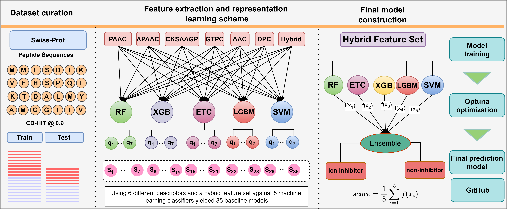

# NaII-Pred
### An ensemble model for the identification and prediction of sodium ion inhibitors
High-affinity ligand peptides for ion channels are essential for controlling the flow of ions across the plasma membrane. These peptides are now being investigated as possible therapeutic possibilities for a variety of illnesses, including cancer and cardiovascular disease. So, the identification and interpretation of ligand peptide inhibitors to control ion flow across cells becomes pivotal for exploration. In this work, we developed an ensemble-based model, NaII-Pred, for the identification of sodium ion inhibitors. The ensemble model was trained, tested, and evaluated on two datasets: a balanced dataset and an unbalanced dataset. The NaII-Pred method employs six different descriptors and a hybrid feature set in conjunction with five conventional machine learning classifiers to create 35 baseline models. Through an ensemble approach, the top four baseline models trained on the hybrid feature set are integrated to yield the final predictive model, NaII-Pred. Our proposed model, NaII-Pred, outperforms the baseline models and the current predictors on both datasets. We believe NaII-Pred will play a critical role in screening and identifying potential sodium ion inhibitors and will be an invaluable tool.

 
 

# Requirments
### 1. scikit-learn:   1.2.1
### 2. xgboost:   2.0.3
### 3. lightgbm:   4.3.0
### 4. optuna:   3.6.0

 
 

# Architecture

